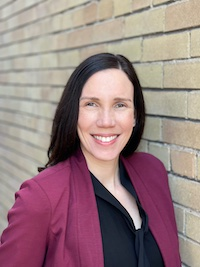

|:--------------------------|:---------------------------------------------|
|        | I am an Associate Professor, Teaching Stream in Computer Science at the University of Toronto.  I received my MMath and Certificate in University Teaching from the University of Waterloo and my BSC from the University of Prince Edward Island. 
||I primarily teach introductory programming courses and have co-developed two Coursera MOOCs ([LTP1](https://www.coursera.org/course/programming1){:target="_blank"} and [LTP2](https://www.coursera.org/course/programming2){:target="_blank"} on learning to program in Python.  I am also engaged in Computer Science education [projects](/publications) and co-authored an [introductory textbook](https://pragprog.com/book/gwpy2/practical-programming){:target="_blank"} on Python programming.|
||I was awarded the Faculty of Arts &amp; Science Outstanding Teaching Award in 2014, and have received the Dean's Excellence Award several times.|
